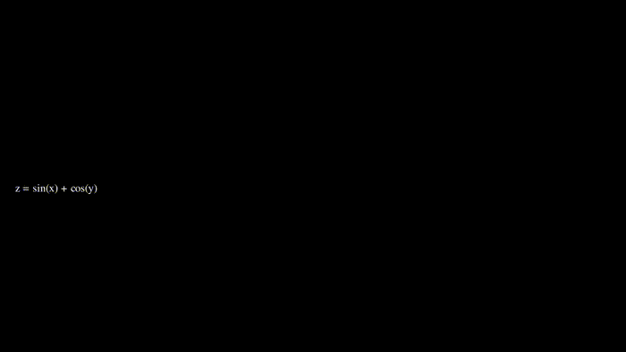

# 🧶 Strands Agents + MCP Tutorial — Manim Visualizations

<p align="center">
  
</p>

*A minimal end-to-end tutorial to build an autonomous agent that generates mathematical animations using AWS Strands, Manim, and MCP.*


[](https://github.com/psf/black)

> Author: [Daniel Puente Viejo](https://www.linkedin.com/in/danielpuenteviejo/)

---

## 🎯 Objective

This repository shows how to **combine AWS Strands Agents + Manim** to enable **model-driven visualization** using the **Model Context Protocol (MCP)**.
We will build an autonomous agent that accepts natural language math queries and orchestrates a local rendering engine to produce high-quality videos using **native AWS Bedrock models**.

---

## 🧠 Core Idea

We move away from hard-coded workflows to a fluid, 4-step autonomous process:

1.  **Query:** You provide a prompt (e.g., *"Create a grid and a unit square. Apply a shear transformation matrix [[1, 1], [0, 1]] to the grid to show how the space distorts."*).
2.  **Tool Use:** The **Strands Agent** uses the MCP tool to write the necessary Python/Manim code.
3.  **Execution:** The local MCP server receives the code and runs the rendering engine.
4.  **Generation:** A video file is generated and saved to your output folder.

---

## 🧩 Requirements

This project uses **uv** for dependency management.

- **Environment Variables:**
  Create a `.env` file with your AWS credentials:
  ```plaintext
  AWS_ACCESS_KEY_ID=<your_aws_access_key>
  AWS_SECRET_ACCESS_KEY=<your_aws_secret_key>
  AWS_REGION=<your_aws_region>
  ```

---

## 🚀 How to Run

This project is set up with `pyproject.toml` and `uv.lock`. You will need two terminal windows to run the agent and the server simultaneously.

### 1. Start the MCP Server
In the first terminal, launch the server that handles the Manim engine:
```bash
uv run start_mcp_server.py
```

### 2. Run the Agent
In a second terminal, launch the client application to start chatting with the agent:

```bash
uv run app.py
```

---

## 📃 License
This project is licensed under the MIT License - see the [LICENSE](LICENSE) file for details.